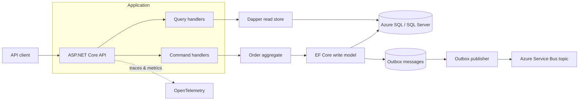
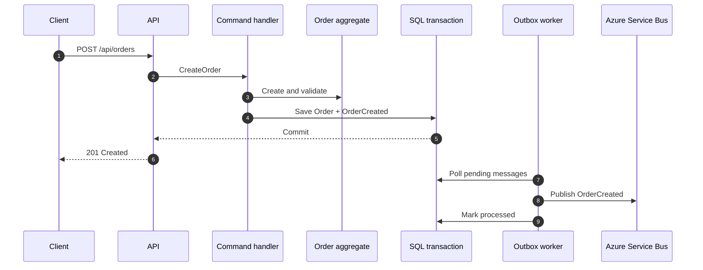

# Commerce CQRS

[](https://github.com/lcarlini/CQRS/actions/workflows/ci.yml)
[](https://dotnet.microsoft.com/)
[](https://azure.microsoft.com/)
[](LICENSE)

Production-minded order processing built with CQRS, ASP.NET Core, SQL Server, and Azure Service Bus. The project keeps the write model focused on business rules while a Dapper-based read model serves purpose-built queries.

**New here?** Open the visual walkthrough: [docs/index.html](docs/index.html) — commands vs queries, order flows, and the layer map.

## Why this project exists

Commerce CQRS is a compact reference implementation for systems that need clear command/query boundaries without turning every operation into a separate microservice. It demonstrates the architecture around a realistic order lifecycle:

- create, confirm, search, and cancel orders;
- enforce invariants inside a domain aggregate;
- persist writes through Entity Framework Core;
- execute read-optimized SQL through Dapper;
- publish domain events reliably with the transactional outbox pattern;
- run locally with SQL Server and Jaeger;
- deploy to Azure Container Apps using Bicep and managed identity.

## Architecture



The dependencies point inward: `Domain` has no infrastructure dependencies, `Application` defines use cases and ports, and `Infrastructure` implements those ports.

### Command flow



The order and its integration event are committed together. If Service Bus is temporarily unavailable, the worker retries the outbox instead of losing the event.

## Technology

- .NET 10 and ASP.NET Core Minimal APIs
- Entity Framework Core for the transactional write model
- Dapper for explicit, read-optimized queries
- SQL Server locally and Azure SQL in the cloud
- Azure Service Bus with passwordless managed identity support
- OpenTelemetry traces and metrics
- Docker Compose, Jaeger, Bicep, xUnit, and GitHub Actions

## Run locally

### One command

Docker is the only prerequisite:

```bash
docker compose up --build
```

Then open:

- Swagger UI: <http://localhost:8080/swagger>
- health check: <http://localhost:8080/health>
- Jaeger traces: <http://localhost:16686>

SQL Server data is stored in the `sql-data` volume. The API applies versioned EF Core migrations at startup; set `Database__ApplyMigrations=false` when migrations are managed by a separate deployment job.

### Run the API from the CLI

Start SQL Server with `docker compose up sql jaeger`, then:

```bash
dotnet restore
dotnet run --project src/Commerce.Cqrs.Api
```

Secrets can override configuration through environment variables:

```text
ConnectionStrings__Orders=...
ServiceBus__ConnectionString=...
ServiceBus__FullyQualifiedNamespace=my-namespace.servicebus.windows.net
```

Use either the Service Bus connection string for local development or the fully qualified namespace with Azure credentials. No message broker is required to explore the API locally.

## Try the order lifecycle

Create an order:

```bash
curl -X POST http://localhost:8080/api/orders \
  -H "Content-Type: application/json" \
  -d '{
    "customerEmail": "engineer@example.com",
    "lines": [
      { "sku": "BOOK-001", "productName": "Architecture Patterns", "quantity": 1, "unitPrice": 49.90 },
      { "sku": "MUG-001", "productName": "Engineering Mug", "quantity": 2, "unitPrice": 18.50 }
    ]
  }'
```

Use the returned identifier to query and confirm it:

```bash
curl http://localhost:8080/api/orders/{orderId}
curl -X POST http://localhost:8080/api/orders/{orderId}/confirm
curl "http://localhost:8080/api/orders?status=Confirmed&page=1&pageSize=20"
```

## Azure deployment

`infra/main.bicep` provisions:

- Azure Container Apps with scaling and health probes;
- Azure SQL Database;
- Azure Service Bus and the `order-events` topic;
- Log Analytics and Application Insights;
- a system-assigned managed identity with Service Bus sender access.

Build and publish the container, then deploy:

```bash
az deployment group create \
  --resource-group <resource-group> \
  --template-file infra/main.bicep \
  --parameters containerImage=<registry>/commerce-cqrs:<tag> \
               sqlAdministratorPassword=<strong-password>
```

For a production environment, place SQL behind a private endpoint and source its credentials from Key Vault. The sample keeps public access enabled so the deployment remains understandable and reproducible.

## Repository layout

```text
src/
├── Commerce.Cqrs.Api             HTTP endpoints, errors, health, telemetry
├── Commerce.Cqrs.Application     commands, queries, handlers, ports
├── Commerce.Cqrs.Domain          aggregate, value rules, domain events
└── Commerce.Cqrs.Infrastructure  EF Core, Dapper, outbox, Service Bus
tests/
└── Commerce.Cqrs.Tests           domain and application tests
infra/
└── main.bicep                    Azure environment
```

## Engineering choices

- **CQRS, not event sourcing.** SQL remains the source of truth; domain events communicate committed changes.
- **Transactional outbox.** Business data and events share one SQL transaction.
- **At-least-once delivery.** Consumers should use `MessageId` for idempotency.
- **Independent read code.** Queries do not hydrate aggregates and can evolve around client needs.
- **Observable by default.** Health checks and OTLP telemetry are part of the application, not deployment afterthoughts.

## Quality checks

```bash
dotnet build Commerce.Cqrs.slnx --configuration Release
dotnet test Commerce.Cqrs.slnx --configuration Release
az bicep build --file infra/main.bicep
```

The CI workflow performs the same build and test checks, captures coverage, builds the container, and validates the Bicep template.

## License

Released under the [MIT License](LICENSE).